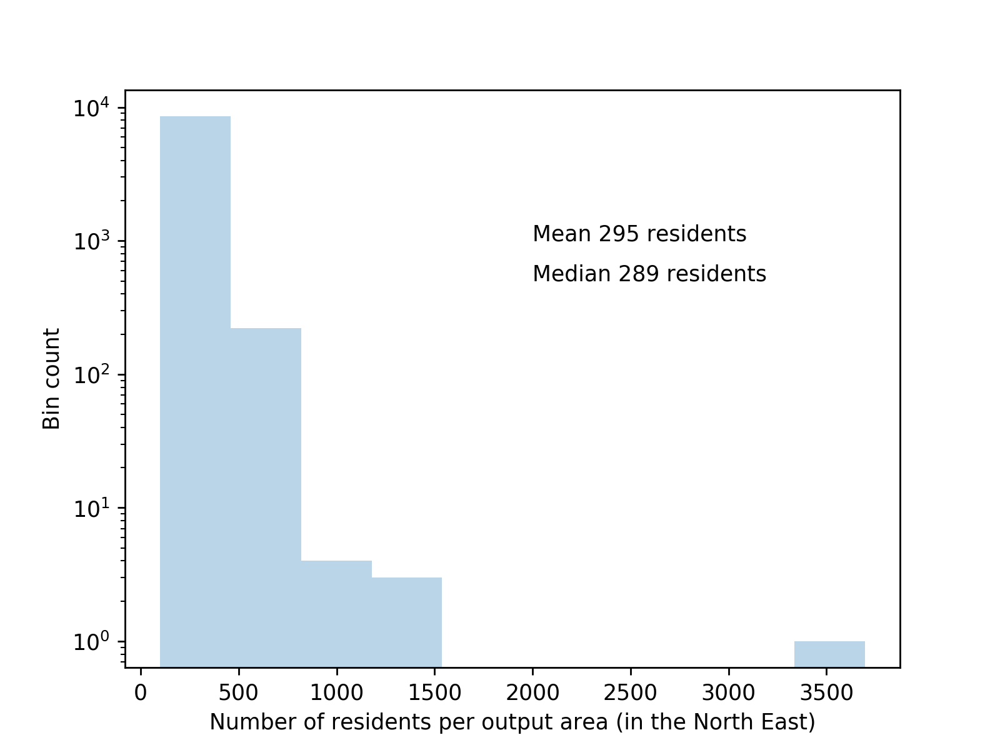

Geographic Information
========
We use datasets extracted from Census information recorded in 2011 and managed by [Nomis](https://www.nomisweb.co.uk/). The datasets contain information based on "Usual residents", defined as anyone who, on census day, was in the UK and had stayed or intended to stay in the UK for a period of 12 months or more, or had a permanent UK address and was outside the UK and intended to be outside the UK for less than 12 months.

The dataset is subdivided in different type of areas, from which these seem to be the most relevant to us

- Output Areas, are the smallest geographic unit for which outputs are published (can only download them by region). For now, we are only working with North East Output Areas,

- MOAs

