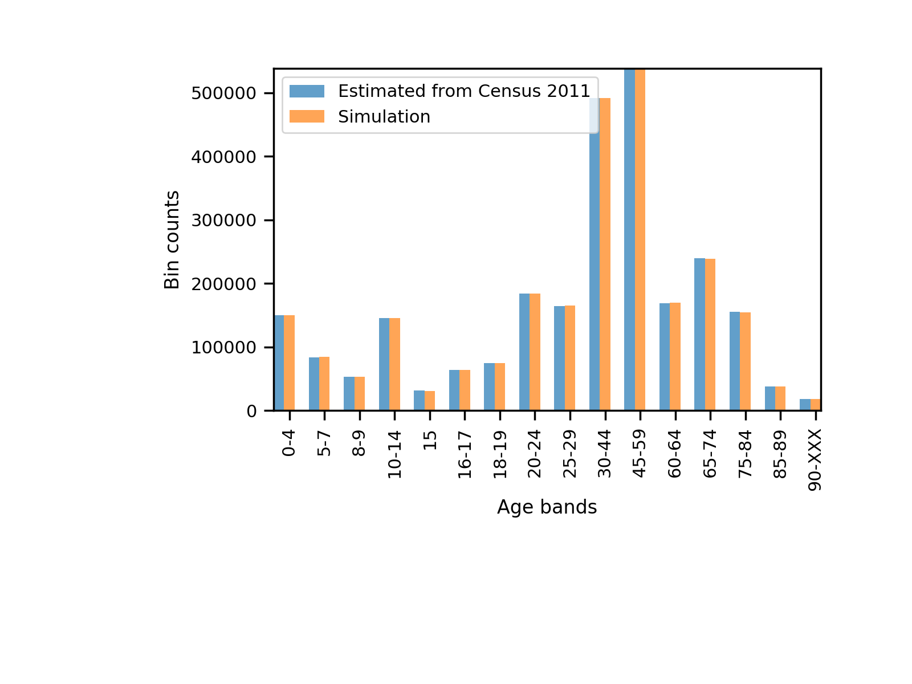

Populating output areas with realistic household characteristics
========
We have populated output areas with households that have realistic age compositions, using the following datasets extracted from Nomis,
- [KS101EW](https://www.nomisweb.co.uk/census/2011/ks101ew), classifies the usual resident population by sex. We use it to extract the number of residents by output area, and the sex composition.
- [KS102EW](https://www.nomisweb.co.uk/census/2011/ks102ew), classifies the usual resident population by age. The age intervals given are:

    + Age 0 to 4
    - Age 5 to 7
    - Age 8 to 9
    - Age 10 to 14
    - Age 15
    - Age 16 to 17
    - Age 18 to 19
    - Age 20 to 24
    - Age 25 to 29
    - Age 30 to 44
    - Age 45 to 59
    - Age 60 to 64
    - Age 65 to 74
    - Age 75 to 84
    - Age 85 to 89
    - Age 90 and over

Given these datasets we populate all output areas with Person instances by matching the output area observations in terms of sex and age composition. See figures below to check results.

