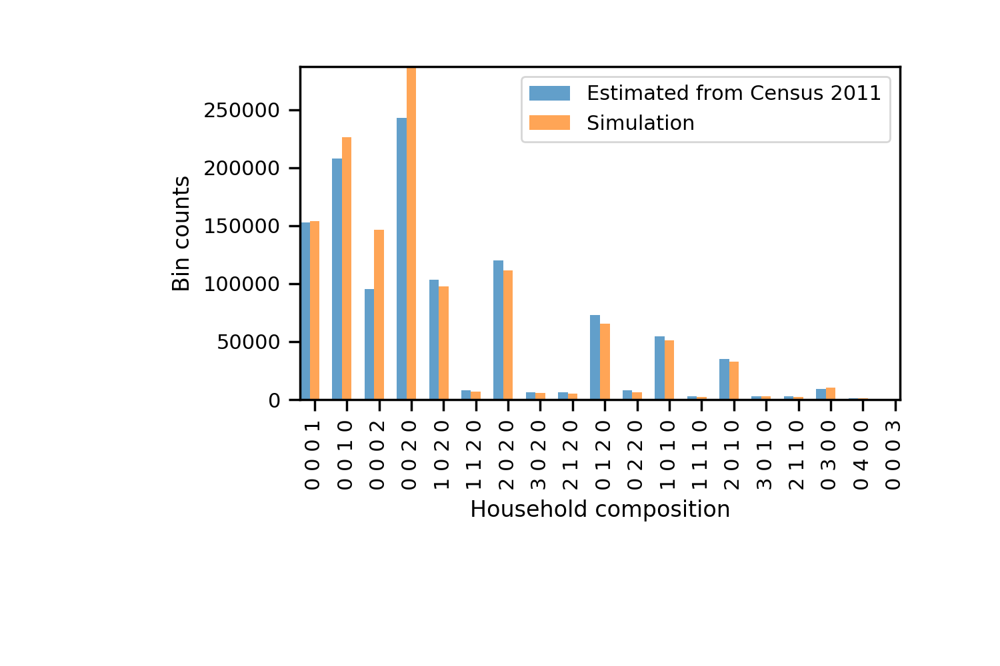

Populating output areas with realistic household characteristics
========
Given a household configuration, we use the encoding

```python
"n_kids n_students n_adult n_old"
```

where ``n_kids`` is the number of people under 18 years old, ``n_students`` is the number of people between the age of 18 and 24 (without caring if they are really a student or not), ``n_adult`` is the number of people from 18 to 65 years old, and finally ``n_old`` corresponds to +65 years of age. The possible 19 household configurations currently considered are:

- ``"0 0 0 1"`` : One old person

- ``"0 0 0 2"`` : Two old people

- ``"0 0 0 3"`` : Three old people

- ``"0 0 1 0"`` : One adult

- ``"0 0 2 0"`` : Two adults

- ``"1 0 1 0"`` : One adult and one kid

- ``"2 0 1 0"`` : One adult and two kids

- ``"3 0 1 0"`` : One adult and three kids

- ``"1 1 1 0"`` : One adult, one kid, and one student

- ``"2 1 1 0"`` : One adult, two kids, and one student

- ``"1 0 2 0"`` : Two adults and one kid

- ``"2 0 2 0"`` :  Two adults and two kids

- ``"3 0 2 0"`` :  Two adults and three kids

- ``"1 1 2 0"`` : Two adults, one kid, and one student

- ``"2 1 2 0"`` : Two adults, two kids, and one student

- ``"0 3 0 0"`` : Three students

- ``"0 4 0 0"`` : Four students

- ``"0 1 2 0"`` : Two adults and one student

- ``"0 2 2 0"`` : Two adults and two students

  

The algorithm that it is used to allocate pople in houses is found in the ``distributor.py`` module. Given the local population of the output area, the algorithm then initializes a household randomly following the distribution of household configurations from the nomis data, then it tries to fill the given configuration with the pool of people. If the full configuration cannot be achieved (for instance, household configuration is two old people, but we only have one left) then the house is left half empty, and the household configuration is updated to reflect the actual one. That means that new configurations can appear, for instance if there is only one student left, and we create a student household, then the configuration would be ``"0 1 0 0 "`` which was not in the original input.




In the future, we will work on the following improvements,
- Add families with more than three kids (following Poisson dist).
- Create more households with only adults.
- Match the age of couples (as it is now, the worst case scenario is a 25 year old with a 65, and a 65 with a 99).

