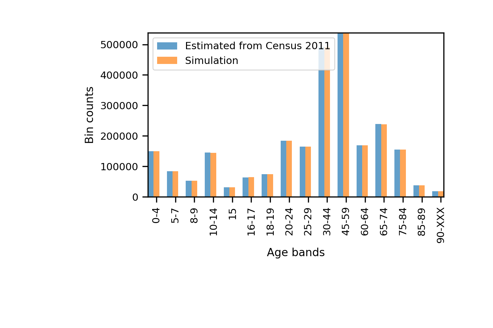

Populating postcode sectors with realistic household characteristics
========
We have populated postcode sectors with households that have realistic age compositions, using the following datasets extracted from Nomis,
- [KS101EW](https://www.nomisweb.co.uk/census/2011/ks101ew), classifies the usual resident population by sex. We use it to extract the number of residents by postcode sector, and the sex composition.
- [KS102EW](https://www.nomisweb.co.uk/census/2011/ks102ew), classifies the usual resident population by age. The age intervals given are:

    + Age 0 to 4

    - Age 5 to 7
    - Age 8 to 9
    - Age 10 to 14
    - Age 15
    - Age 16 to 17
    - Age 18 to 19
    - Age 20 to 24
    - Age 25 to 29
    - Age 30 to 44
    - Age 45 to 59
    - Age 60 to 64
    - Age 65 to 74
    - Age 75 to 84
    - Age 85 to 89
    - Age 90 and over

- [LC1402EW](https://www.nomisweb.co.uk/census/2011/lc1402ew), classifies households by household composition and by number of bedrooms. We use this information to generate realistic households by postcode sector assuming that, i) Families in which all members are over 65's, are composed of couples, ii) Lone parents with one or two bedrooms only have one child, iii) Lone parents with three or more bedrooms only have two children, iv) Families classified as others count as young adults with no children.

Given these datasets we populate all postcode sectors with Person instances by matching the postcode sector observations in terms of sex, age and household composition. See figures below to check results,

