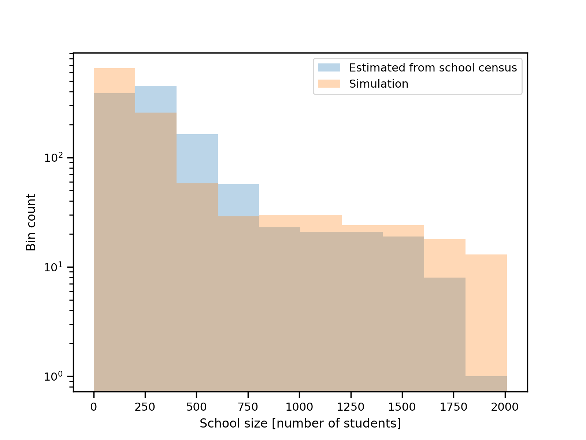
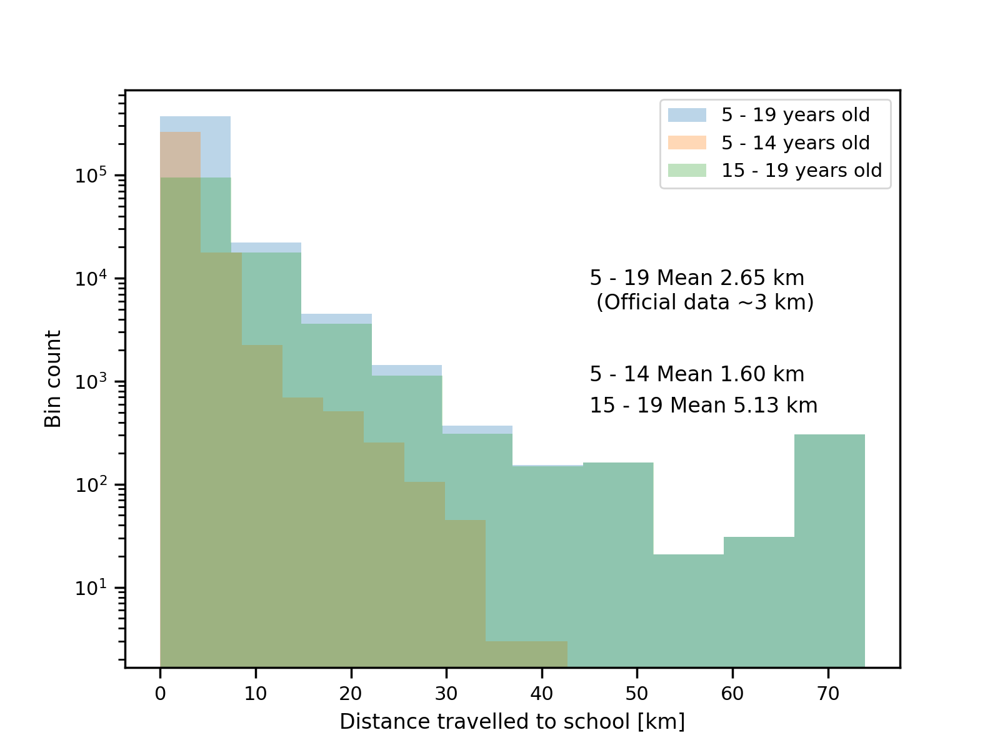

Populating schools
========

We use data from [school data](https://www.gov.uk/school-performance-tables) to find the location of schools, the number of pupils they have, and the age range of their pupils. 

To populate schools with children, we iterate over all children in an output area and assign them the closest school with vacancies in their age range, from the N-closest schools (N being 6 for now). We make the following assumptions,

- The location of the child is considered to be the location of the output area (obtained from data/geographical_data/oa_coorindates.csv). 

- Given that we only know the age range of a person, we use the centre of the age bin to which the pupil belongs (see more on Populating output areas), to determine whether the pupil can access a given school with a given age range.

- If all the N-nearest schools do not have vacancies, assign the kid to its closest school anyway.

Below, we show that the distribution of school sizes is still closely matched,

Moreover, we can compute the distance children have to travel to go to school. The results can be seen below,

The mean distance travelled to school is close to the national average (see summary data from 2014 here [school survey](https://assets.publishing.service.gov.uk/government/uploads/system/uploads/attachment_data/file/476635/travel-to-school.pdf)). Moreover, we also find older students tend to travel further away.

